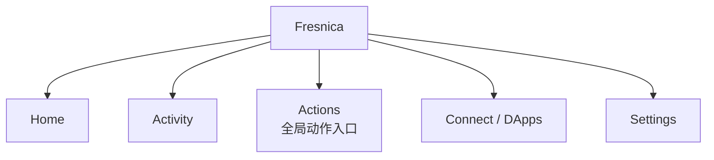
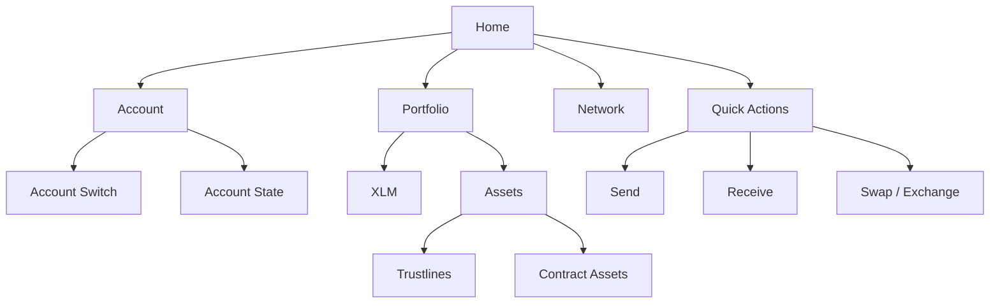
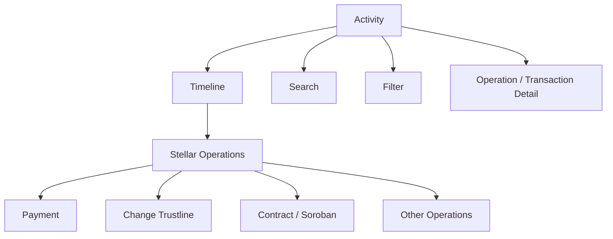
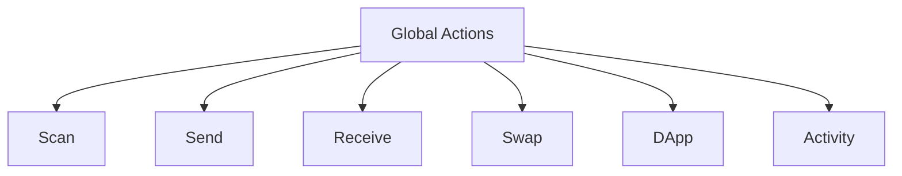
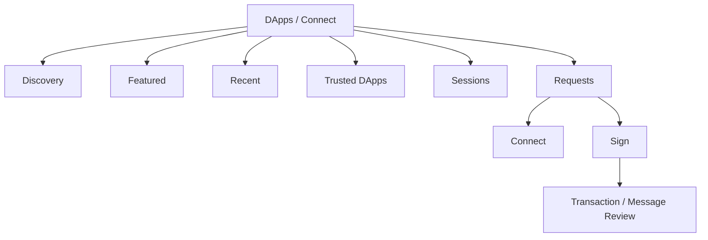
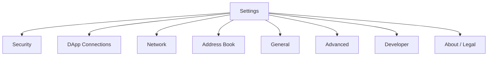
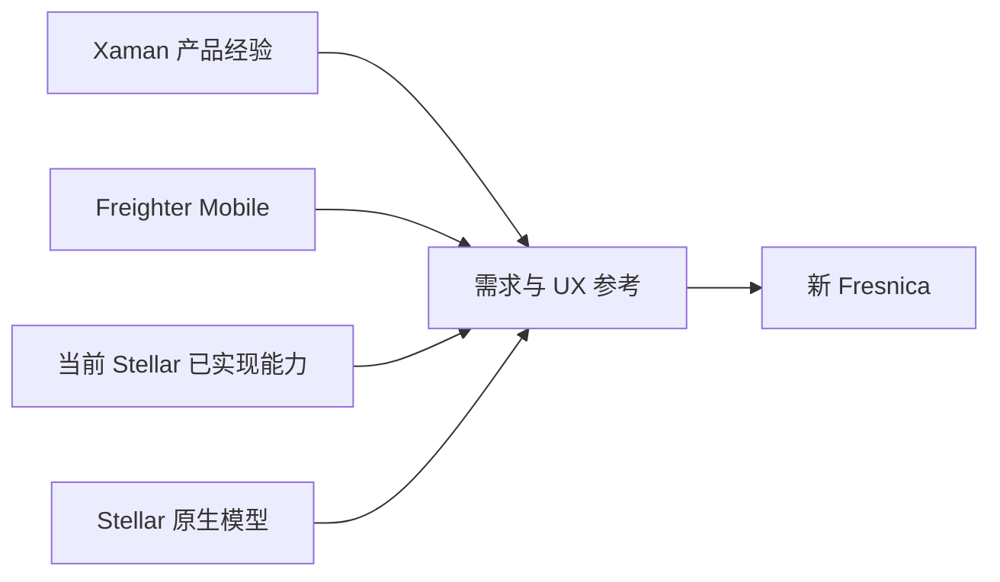

# Fresnica 产品信息架构

> 状态：Phase 1 初版
> 
> 本文描述用户看到的产品结构，不描述代码目录结构。新版本以 Stellar-native 钱包体验为核心，并以现有 `Stellar` 项目作为行为基线。

## 1. 一级导航

现有项目的五个底部入口为 Home、Events、Actions、XApps、Settings；其中 Actions 不切换 Tab，而是打开全局 Action Panel。因此新版本保留“五入口”产品结构，但将 Events 正式定义为 Activity，将 XApps 的 Xaman 语义改造为 Stellar DApp / Connect。

## 2. Home

Home 的职责是“钱包总览”，不承载链底层实现。资产、账户、网络状态通过 Application/Domain 层获取。

## 3. Activity

现有项目已经包含分页、缓存、gap detection/backfill 等历史记录能力，这些属于有效产品资产，不因重写而删除。

## 4. Actions

Actions 是应用级快捷入口，而不是独立业务域。

## 5. Connect / DApps

XApps 是旧产品命名。新版本围绕 Stellar DApp 连接能力重新定义：

关键原则：删除 XApp/Xaman 实现，不删除 DApp、连接、可信连接、签名请求等产品能力。

## 6. Settings

## 7. 产品层级规则

1. Tab 是一级导航。
2. Page/Feature 是二级产品结构。
3. Flow 是跨页面行为，不把 Flow 当成 Tab。
4. Stellar Domain 是业务模型，不与 Tab 混为一层。
5. Security 是横切能力，同时约束 Account、Signer、DApp、Transaction 等 Flow。

## 8. 设计目标

新 Fresnica 的产品结构不是复制 Xaman，也不是复制 Freighter，而是：

