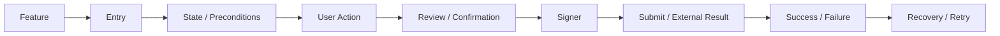

# Fresnica 功能资产盘点

> 状态：Phase 1 初版。此文档是迁移基线，不代表最终功能范围。

## 1. 盘点方法

当前 `Stellar` 项目已经经过深度改造，不能只依赖 Git diff。盘点同时使用：

- 产品结构：5 个底部入口及其页面。
- 代码结构：新增/修改文件、services、store、screens、freighter 等。
- 行为结构：关键用户 Flow、状态机、异常处理。
- Stellar 语义：Account、Asset、Trustline、Operation、Transaction、Soroban。
- 遗留审计：XRPL/Xaman domain、命名、协议、Native 工程残留。

## 2. 功能矩阵

| 产品域 | 能力 | 当前基线 | 新 Fresnica | 迁移策略 |
|---|---|---:|---:|---|
| Home | Account Switch | 已有 | 保留 | 重新实现 |
| Home | Portfolio / Assets | 已有 | 保留 | Stellar-native |
| Home | Network Switch | 已有 | 保留 | 重新实现 |
| Home | Send | 已有 | 保留 | Stellar Transaction |
| Home | Receive / QR | 已有 | 保留 | Stellar address URI |
| Home | Exchange | 已有 | 评估 | 重新定义 Stellar 交易模型 |
| Activity | Operation History | 已有 | 保留 | 迁移行为 |
| Activity | Pagination | 已有 | 保留 | 重写 Repository |
| Activity | Cache | 已有 | 保留 | 新 Data Layer |
| Activity | Gap Detection / Backfill | 已有 | 保留 | 独立 History Service |
| Actions | Scan | 已有 | 保留 | 重写 |
| Actions | Global Send/Receive | 已有 | 保留 | 重写 |
| DApp | Discovery | 已有 | 保留 | 去除 XApp 语义 |
| DApp | Recent / Featured | 已有 | 保留 | 重新设计数据源 |
| DApp | Trusted DApp | 已有 | 保留 | Permission Domain |
| DApp | Auto Connect | 已有 | 保留 | Session Domain |
| DApp | Freighter API | 已有 | 保留 | Protocol Adapter |
| DApp | Signing Request | 已有 | 保留 | Signing Domain |
| DApp | Transaction Review | 已有 | 保留 | Stellar-native decoder |
| Settings | Security | 已有 | 保留 | 重新建模 |
| Settings | Connected DApps | 已有 | 保留 | Session/Permission |
| Settings | Session Log | 已有 | 保留 | Audit Log |
| Settings | Address Book | 已有 | 保留 | 新 Domain |
| Settings | Developer | 已有 | 评估 | 新环境系统 |
| Wallet | Mnemonic / Key Derivation | 已有 | 保留 | 安全重写 |
| Wallet | Secure Storage | 已有 | 保留 | Native Secure Storage |
| Wallet | Hardware Signer | 已有 | 保留 | Signer Adapter |
| Stellar | Horizon | 已有 | 保留 | Repository |
| Stellar | Soroban RPC | 部分 | 补全 | Stellar Client |
| Stellar | Trustline | 已有 | 保留 | Stellar-native |
| Stellar | Contract Asset | 部分 | 补全 | Asset Domain |

## 3. Flow 完整性要求

任何“功能”进入新项目之前必须能回答：

因此例如“DApp”不能作为单个勾选项迁移，而必须覆盖连接、权限、Session、可信状态、请求、Review、签名、结果、断开等完整行为。

## 4. 迁移状态定义

- **保留**：产品能力仍然成立，重新实现。
- **重设计**：能力成立，但原交互或数据模型依赖旧架构。
- **删除**：纯 XRPL/Xaman 能力，Stellar 产品没有对应需求。
- **补全**：当前项目已有部分实现，新版本必须补齐。
- **验证**：依赖 Stellar 协议、SEP、Soroban 或第三方 SDK，需要 PoC。
