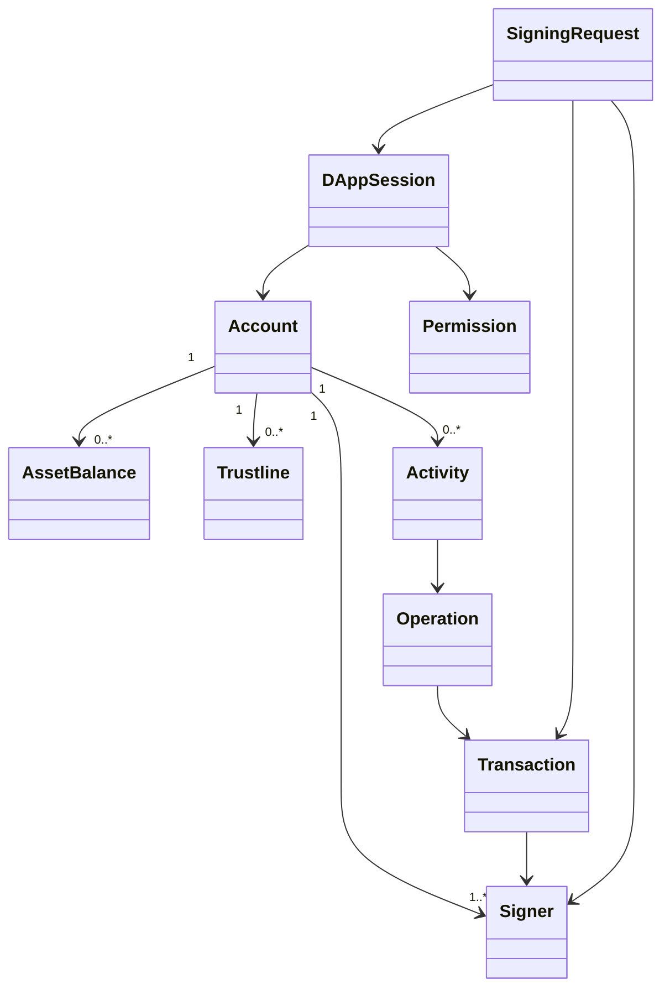
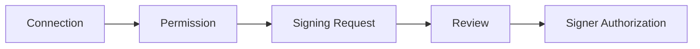

# Fresnica Stellar Domain Model

> 核心原则：新版本不建立通用多链 Wallet Engine。Domain 直接表达 Stellar 能力。

## 1. 总体模型



## 2. 核心对象

### Account

表示 Stellar account，而不是抽象链账户。

职责：地址、账户状态、signers、余额、trustlines、账户级 metadata。

### Signer

签名能力独立于 Account。

类型可以包括：

- Local Key Signer
- Hardware Signer
- Watch-only / No Signer
- Future external signer

UI 不直接持有私钥；Signer 负责授权签名。

### Asset

统一表示：

```text
Native XLM
Classic Asset = code + issuer
Contract Asset = contractId
```

### Trustline

Stellar-specific domain object，不抽象成其他链的“token attachment”。

### Operation

Activity 的核心语义。Transaction 是容器，Operation 描述具体链上动作。

### Transaction

负责 Stellar transaction envelope、fee、sequence、memo、operations、network/passphrase 等。

### Contract

Soroban 合约相关能力独立建模，避免把合约调用粗暴当成普通转账。

### DAppSession

表示钱包与 DApp 之间的连接状态。

### Permission

连接和签名授权分开：



## 3. 不建立的抽象

新项目不引入：

- `IWalletEngine` 多链接口作为 Domain 根对象。
- XRPL Payload。
- XApp / Xaman Payload。
- Destination Tag 等 XRPL-specific 业务模型。
- 用“通用 Transaction”抹平 Stellar Operation / Soroban 的差异。

## 4. Domain 与基础设施边界

```mermaid
flowchart TB
    UI[Presentation]
    APP[Application / Use Cases]
    DOMAIN[Stellar Domain]
    REPO[Repository Interfaces]
    INFRA[Infrastructure]
    SDK[@stellar/stellar-sdk]
    RPC[Horizon / Soroban RPC]
    SECURE[Native Secure Storage]

    UI --> APP
    APP --> DOMAIN
    APP --> REPO
    REPO --> INFRA
    INFRA --> SDK
    INFRA --> RPC
    INFRA --> SECURE
```

Presentation 不直接依赖 Stellar SDK。Application 负责 orchestration，Domain 负责规则，Infrastructure 负责具体实现。
