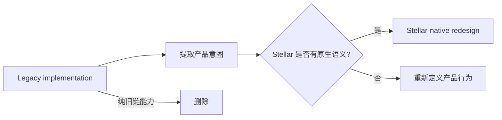
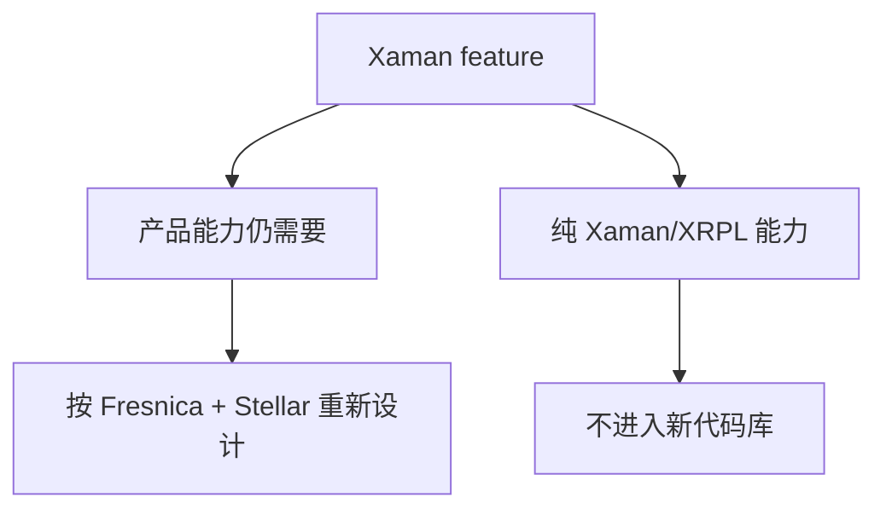

# XRPL / Xaman 遗留清理方案

## 1. 原则

新项目从空仓库开始，**不复制当前 Stellar 的 XRPL/Xaman 实现**。如果某项能力有产品价值，则重新用 Stellar 语义实现。

## 2. 审计分类

### A. Domain 遗留

重点搜索：

- XRPL / XRP / Drops
- Destination Tag
- TrustSet / AccountSet
- Payload
- XApp
- Xaman
- XRPL transaction models

处理：删除或改写为 Stellar domain。

### B. Runtime / Service 遗留

重点搜索：

- XRPL endpoints
- XRPL SDK imports
- Xaman adapters
- Xaman payload handling
- XRP-specific serialization

处理：Stellar Client / Repository / Protocol Adapter 重新实现。

### C. Native 工程遗留

重点搜索：

- `ios/Xaman`
- `XamanTests`
- Xaman schemes / targets
- Xaman-specific entitlements
- XRPL native crypto bridge

处理：新 RN 工程直接生成新的 iOS/Android 工程，不迁移旧 Native 工程。

## 3. Xaman 产品能力的处理方式

例如：

| 旧概念 | 判断 | 新 Fresnica |
|---|---|---|
| XApp | 名称/协议依赖 Xaman | DApp / Connect |
| Payload | Xaman 请求模型 | SigningRequest |
| Trusted XApp | 产品能力 | Trusted DApp / Permission |
| Auto Connect | 产品能力 | Session + Permission |
| Transaction Review | 产品能力 | Stellar Transaction Review |
| XRP / Drops | XRPL domain | 删除 |
| Destination Tag | XRPL domain | 删除；若业务需要 routing，重新设计 |
| TrustSet | XRPL operation | Stellar Trustline |

## 4. 质量门禁

新代码库禁止出现 XRPL/Xaman 关键字进入 Domain。允许在 `docs/architecture/04-xrpl-xaman-removal.md`、迁移审计工具和历史说明中出现。
