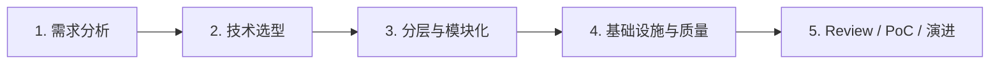
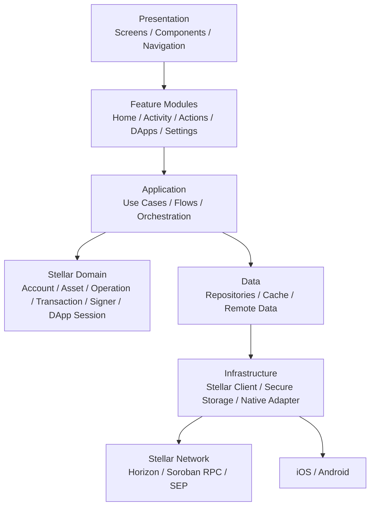
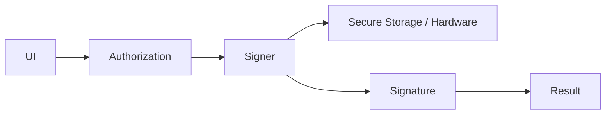

# Fresnica 技术架构

## 1. 五阶段工程流程



## 2. 新 App 分层



## 3. Feature Module

Feature 按产品模块组织，而不是按技术类型堆积：

```text
src/
  app/
  features/
    home/
    activity/
    actions/
    dapps/
    settings/
  domain/
    account/
    asset/
    transaction/
    operation/
    signer/
    dapp-session/
  application/
    send/
    receive/
    swap/
    connect-dapp/
    sign-request/
  infrastructure/
    stellar/
    storage/
    secure-storage/
    hardware/
  shared/
    ui/
    navigation/
    localization/
    telemetry/
```

Feature 可以依赖 Application/Domain/Shared，但不能反向依赖另一个 Feature 的内部实现。

## 4. 状态管理原则

区分三类状态：

1. **Server/chain state**：账户、余额、Activity、DApp metadata，由 Repository/缓存治理。
2. **Session state**：当前账户、网络、DApp session、permissions。
3. **UI state**：弹窗、筛选、表单、loading 等，仅存在于 Feature 内。

不建立一个巨型全局 Store。

## 5. 路由原则

Navigation 只表达页面关系。业务 Flow 使用 Application 层协调。

Deep Link / Universal Link / QR / DApp 请求统一进入 App Router，再解析成明确的 Application Command。

## 6. React Native 基线

新项目以当前稳定版 React Native 为目标。2026-08-25 当前稳定版为 **React Native 0.87**；该版本默认 Strict TypeScript API，并要求 Node.js >= 22.13、Android Gradle Plugin 9、Kotlin 2.0+。citeturn1search0turn1search1

由于 0.87 的 Strict TypeScript API 会阻止 deep imports，新代码禁止依赖 `react-native/Libraries/*` 等内部路径。citeturn1search0

## 7. Stellar Client

使用 `@stellar/stellar-sdk`，但 SDK 只出现在 Infrastructure 边界。Feature 不直接构造 SDK 对象。

```text
Feature
  ↓
Use Case
  ↓
Transaction Builder / Repository
  ↓
Stellar Infrastructure
  ↓
@stellar/stellar-sdk
```

## 8. Security Boundary



私钥不得进入普通 UI state、日志、analytics、错误上报或持久化 JSON。

## 9. 工程质量

最低要求：

- TypeScript strict。
- ESLint + Prettier。
- Unit tests：Domain/Application/Security。
- Integration tests：Stellar repositories。
- E2E：核心钱包 Flow、DApp connection/signing。
- CI：typecheck、lint、test、依赖审计。
- ADR：重大架构决定记录在 `docs/architecture/adr/`。
